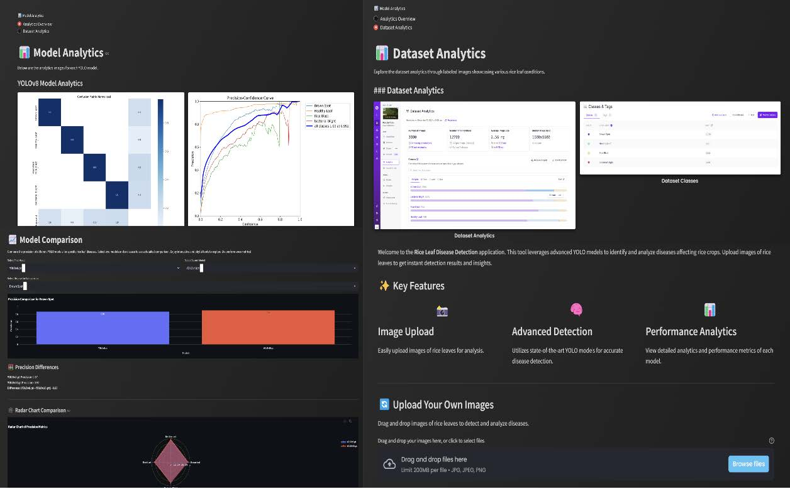

# 🌾 Rice Leaf Disease Detection using YOLO (v8, v10, v11)

A data-driven deep learning project for detecting rice leaf diseases using advanced YOLO object detection models. This system aims to support early disease diagnosis and improve agricultural productivity through automated image-based analysis.

---

## 📌 Introduction

Rice (Oryza sativa L.) is a staple food for more than half of the global population, especially in Asia. However, rice crops are highly vulnerable to diseases such as **Bacterial Blight, Brown Spot, and Rice Blast**, which significantly reduce yield and quality.

Traditional disease detection methods rely on **manual inspection**, which is:
- Time-consuming  
- Labor-intensive  
- Prone to human error  

With advancements in **Computer Vision and Deep Learning**, automated disease detection has become a promising solution.

This project explores the use of **YOLO (You Only Look Once)** algorithms to develop an accurate, efficient, and real-time rice leaf disease detection system.

---

## 🎯 Objectives

The main objectives of this project are:

- 📊 Analyze and preprocess rice leaf image datasets  
- 🧠 Develop deep learning models using YOLOv8, YOLOv10, and YOLOv11  
- 🔍 Detect and classify rice leaf diseases:
  - Bacterial Blight  
  - Brown Spot  
  - Rice Blast  
- 📈 Evaluate performance using Precision, Recall, F1-score, and mAP  
- 🖥️ Build an interactive dashboard for real-time detection  

---

## 🚀 Project Overview

This project follows a structured machine learning pipeline:

1. Problem Identification & Research  
2. Data Collection & Annotation  
3. Model Training & Development  
4. Model Testing & Evaluation  
5. Dashboard Development  

The system enables **real-time detection** using YOLO models integrated into a **Streamlit dashboard**.

---

## 🧪 Methodology

### 📂 Data Collection
- Datasets sourced from Kaggle  
- Includes healthy and diseased rice leaf images  

### ✏️ Data Annotation
- Annotated using **Roboflow**
- Polygon labeling for precise disease detection
- Classes:
  - Healthy Leaf  
  - Bacterial Blight  
  - Brown Spot  
  - Rice Blast  

### 🔄 Data Augmentation
- Rotation, flipping, scaling, and color adjustments  
- Improves robustness and generalization  

---

## 🧠 Model Development

Models used:
- **YOLOv8** – Baseline  
- **YOLOv10** – Improved efficiency  
- **YOLOv11** – Best performing model  

### ⚙️ Training Setup
- Platform: Google Colab (GPU)
- Framework: PyTorch + Ultralytics
- Epochs: 100  
- Batch size: 16  
- Optimizer: SGD with momentum  

---

## 📊 Model Performance

| Model   | mAP Score | Performance |
|--------|----------|------------|
| YOLOv11 | **92.9%** | 🥇 Best |
| YOLOv10 | 89.9% | 🥈 |
| YOLOv8  | 88.0% | 🥉 |

### 📈 Insights
- YOLOv11 achieved the highest accuracy due to better feature extraction  
- Strong performance across all models  
- Minor confusion with complex backgrounds  

---

## 🖥️ Dashboard (Streamlit App)

The project includes an interactive dashboard that allows users to:

- Upload rice leaf images  
- Perform real-time disease detection  
- View bounding boxes and predictions  
- Analyze model outputs  

### 📊 Dashboard Preview

